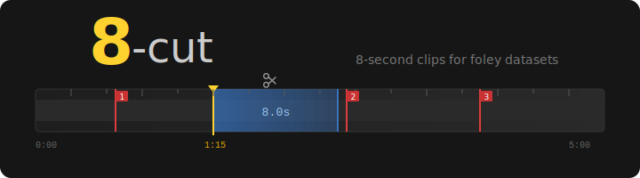
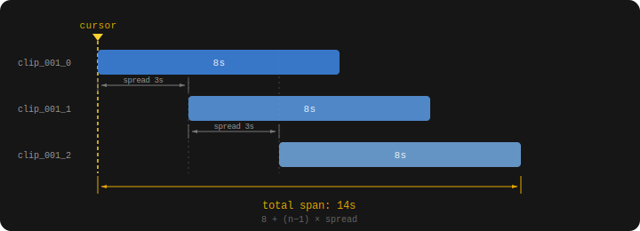

# 8-cut

<p align="center">
  
</p>

<p align="center">
  <a href="https://github.com/ethanfel/8-cut/blob/master/LICENSE"></a>
</p>

A desktop tool for cutting 8-second clips from video files, designed for building foley datasets. Includes audio classification for automated scanning and batch export.

## Overview

8-cut lets you scrub through a video, mark a cut point, and export a batch of overlapping 8-second clips with one keypress. It tracks every export in a local SQLite database so you can resume a session without duplicating work.

All clips are exactly 8 seconds — the standard length for foley sound datasets.

<p align="center">
  
</p>

## Features

### Clip export

- **Frame-accurate scrubbing** — click or drag the timeline; arrow keys and J/L for frame-by-frame, Shift for 1-second steps
- **Batch export** — export multiple overlapping clips per cut point with configurable count and spread offset
- **Two export formats** — H.264 MP4 with lossless PCM audio, or WebP image sequence (frames + `.wav`)
- **Portrait crop** — crop to 9:16, 4:5, or 1:1 before export; click the video or crop bar to reposition
- **Random portrait/square** — optionally apply a random crop to a subset of each batch
- **Resize** — scale short side to a fixed pixel size (e.g. 512)
- **Hardware encoding** — GPU-accelerated export via NVENC, VAAPI, QSV, AMF, or VideoToolbox
- **Subject tracking** — auto-adjust crop center using YOLOv8 detection (optional)

### Audio scanning

- **Embedding models** — WAV2VEC2 (base/large), HuBERT (base/large/xlarge), BEATs
- **Train classifier** — train a gradient boosting classifier on your exported clips to find similar audio
- **Scan video** — detect regions matching your trained model with configurable threshold
- **Scan All** — batch scan every video in the playlist
- **Region fusion** — merge overlapping detections into contiguous regions
- **Hard negatives** — mark false positives to refine training
- **Model versioning** — timestamped backups with rollback support
- **Scan export** — batch export from scan results with spread and minimum duration filtering

### Scan results panel

- **Tabbed results** — one tab per model, showing start/end/score per region
- **Disable regions** — Delete/Backspace toggles regions off (greyed out, excluded from export) without removing them
- **Resize regions** — double-click Time or End cells to edit, or drag region edges directly on the timeline
- **Grey ghost** — trimmed portions of resized regions shown as grey overlay on timeline
- **Undo** — Ctrl+Z reverts the last disable, resize, drag, or negative toggle

### Organization

- **Sound annotation** — label and category fields saved to the clip database and `dataset.json`
- **Export history** — timeline markers show previously exported clips; double-click to overwrite; right-click to delete
- **Playlist** — drag-and-drop video queue with progress tracking
- **Profiles** — switch between independent marker sets (e.g. "landscape" vs "portrait")
- **Subprofiles** — lightweight export folder variants for multiple output targets
- **Review mode** — clean timeline view for navigating scan results without export clutter

## Keyboard shortcuts

| Key | Action |
|-----|--------|
| `Left` / `J` | Step back 1 frame |
| `Right` / `L` | Step forward 1 frame |
| `Shift+Left` / `Shift+J` | Step back 1 second |
| `Shift+Right` / `Shift+L` | Step forward 1 second |
| `Space` / `P` | Toggle play/pause |
| `K` | Pause and snap to cursor |
| `E` | Export |
| `M` | Jump to next marker (wraps) |
| `N` | Next file in playlist |
| `G` | Toggle cursor lock |
| `Delete` / `Backspace` | Toggle disable on selected scan regions |
| `Ctrl+Z` | Undo last scan panel action |
| `?` / `F1` | Show keyboard shortcuts |

Shortcuts are suppressed when a text field has focus.

## Installation

### Prerequisites

- **Python 3.11+** — [python.org/downloads](https://www.python.org/downloads/)
- **ffmpeg** — video encoding
- **libmpv** — video playback

### Quick start (all platforms)

The setup script creates a virtual environment and installs everything including PyTorch with CUDA support:

```bash
# Linux / macOS
./setup_env.sh

# Windows (PowerShell)
powershell -ExecutionPolicy Bypass -File setup-windows.ps1
```

Then run:

```bash
# Linux / macOS
./8cut.sh

# Windows
8cut.bat
```

The launch scripts auto-detect your venv or conda environment.

### Manual installation

#### 1. Install system dependencies

**Linux (Arch):**
```bash
pacman -S python mpv ffmpeg
```

**Linux (Debian/Ubuntu):**
```bash
apt install python3 python3-venv libmpv-dev ffmpeg
```

**Windows:**
```powershell
# ffmpeg
winget install ffmpeg

# libmpv — download mpv-2.dll and place next to main.py
# https://sourceforge.net/projects/mpv-player-windows/files/libmpv/
```

**macOS:**
```bash
brew install python mpv ffmpeg
```

#### 2. Create a virtual environment

A virtual environment keeps 8-cut's dependencies isolated from your system Python. This is strongly recommended — PyTorch alone is several GB and can conflict with other projects.

**Using venv (recommended):**

```bash
# Create the venv in the project directory
python3 -m venv .venv

# Activate it
# Linux / macOS:
source .venv/bin/activate
# Windows (cmd):
.venv\Scripts\activate.bat
# Windows (PowerShell):
.venv\Scripts\Activate.ps1
```

**Using conda / miniforge:**

```bash
conda create -n 8cut python=3.12
conda activate 8cut
```

You must activate the environment every time you open a new terminal before running 8-cut. The `8cut.sh` launcher does this automatically.

#### 3. Install PyTorch

PyTorch must be installed separately with the correct CUDA version for GPU acceleration. Without CUDA, audio scanning will fall back to CPU (much slower).

**With NVIDIA GPU (CUDA 12.8):**
```bash
pip install torch torchaudio --index-url https://download.pytorch.org/whl/cu128
```

**CPU only (no GPU):**
```bash
pip install torch torchaudio --index-url https://download.pytorch.org/whl/cpu
```

Check available CUDA versions at [pytorch.org/get-started](https://pytorch.org/get-started/locally/).

#### 4. Install project dependencies

```bash
pip install -r requirements.txt
```

#### 5. Verify

```bash
python -c "import torch; print('PyTorch', torch.__version__, 'CUDA', torch.version.cuda)"
python -c "import librosa, torchaudio, sklearn; print('All imports OK')"
```

### Running

```bash
# With venv activated:
python main.py

# Or use the launcher (auto-activates venv/conda):
./8cut.sh        # Linux / macOS
8cut.bat         # Windows
```

### GPU encoding

Hardware encoders are auto-detected from ffmpeg. Available encoders by platform:

| Platform | Encoders |
|----------|----------|
| **Linux** | `h264_nvenc` (NVIDIA), `h264_vaapi` (AMD/Intel), `h264_qsv` (Intel) |
| **Windows** | `h264_nvenc` (NVIDIA), `h264_qsv` (Intel), `h264_amf` (AMD) |
| **macOS** | `h264_videotoolbox` |

Enable the **HW** checkbox in the export controls to use GPU encoding.

### Optional: audio scanning

Audio scanning requires PyTorch (installed above). Embedding models are downloaded on first use and cached in `cache/downloads/`. A CUDA-capable GPU is strongly recommended for training and scanning speed.

## Usage

Drop videos onto the queue or click **+ Open Files**. Scrub to your cut point, then press **Export** (or `E`).

### Export layout

Each export creates a group subfolder containing the overlapping sub-clips:

```
output/
  clip_001/
    clip_001_0.mp4      # starts at cursor
    clip_001_1.mp4      # starts at cursor + spread
    clip_001_2.mp4      # starts at cursor + 2 * spread
  clip_002/
    ...
```

With WebP sequence format, each sub-clip becomes a directory of frames plus a `.wav`:

```
output/
  clip_001/
    clip_001_0/
      frame_0001.webp
      frame_0002.webp
      ...
    clip_001_0.wav
```

### Scan export layout

Scan exports create one group folder per detected area:

```
output/
  clip_037/
    clip_037_a1_0.mp4   # area 1, clip 0
    clip_037_a1_1.mp4   # area 1, clip 1
  clip_038/
    clip_038_a2_0.mp4   # area 2, clip 0
    ...
```

### Sound annotation

Set a **Label** (e.g. "dog barking") and **Category** (Human / Animal / Vehicle / Tool / Music / Nature / Sport / Other) before exporting. These are saved to:

- `dataset.json` in the export folder — one entry per clip with `path` and `label`
- The SQLite database — label and category, for recall when you revisit a marker

Labels persist between exports so you can cut many clips of the same class without retyping.

### Overwrite and delete

- **Double-click** a timeline marker to enter overwrite mode — the next export re-encodes all clips in that group to their original paths
- **Right-click** a marker to delete it from the database
- The **Delete** button removes all clips in a group from disk, database, and `dataset.json`

## Audio scan workflow

### 1. Build a dataset

Export clips manually from several videos. Clips from the same export folder (e.g. `mp4_Intense`) become your positive training class.

**Minimum dataset:** ~20 clips from 2–3 different videos. This is enough for the classifier to learn a basic boundary, but expect noisy results — you'll need to mark hard negatives and retrain.

**Ideal dataset:** 50–100+ clips from 5+ videos covering the full range of variation in your target sound (different recording conditions, distances, intensities). More variety in your positives makes the model generalize better to unseen footage. Negatives are sampled automatically from regions far from your markers, but adding explicit negatives of confusable sounds (e.g. thunder when training for explosions) significantly reduces false positives.

The classifier improves iteratively: export a small initial set → train → scan → mark false positives as hard negatives → retrain. Each cycle sharpens the decision boundary without needing a large upfront dataset.

### 2. Train a classifier

Click **Train** to open the training dialog:

- **Positive class** — select the export folder containing your target sounds
- **Negative class** — optional explicit negatives, or leave as "(auto only)" for automatic sampling
- **Model** — embedding model to use (HuBERT XLARGE recommended)
- **Auto-neg margin** — distance from markers to sample automatic negatives (30s default)
- **Include scan-exported clips** — whether to include previously scan-exported clips in training

The classifier trains a `HistGradientBoostingClassifier` on audio embeddings and saves to `models/`.

### 3. Scan videos

Select a trained model from the dropdown and click **Scan**. Adjust the threshold slider to control sensitivity. Detected regions appear as colored bands on the timeline and as rows in the results panel.

### 4. Review and refine

- Toggle **Review** mode for a clean timeline focused on scan results
- **Disable** false positive regions (Delete key) — they stay in the list but are excluded from export
- **Resize** regions by dragging edges on the timeline or editing times in the table
- **Mark as negative** — add false positives to the hard negative set for retraining
- **Ctrl+Z** to undo any of the above

### 5. Export results

Click **Export Scan Results** to batch export all enabled regions. The button shows the estimated clip count based on spread and minimum duration settings.

### 6. Retrain with feedback

Train again — hard negatives are automatically included. Each training run saves with a timestamp. Right-click the model dropdown to restore a previous version if results degrade.

## Database

Export history is stored in `~/.8cut.db` (SQLite). Tables:

| Table | Purpose |
|-------|---------|
| `processed` | Every exported clip with full encoding settings |
| `scan_results` | Audio scan detections per video/model |
| `hard_negatives` | Timestamps marked as false positives for training |
| `hidden_files` | Playlist files hidden by the user |

The database auto-migrates when new columns are added.

## File locations

| Path | Contents |
|------|----------|
| `~/.8cut.db` | SQLite database |
| `models/` | Trained classifier models (`.joblib`) |
| `cache/w2v/` | Embedding cache (`.npz`, keyed by video hash) |
| `cache/downloads/` | Downloaded pretrained models |

## Testing

```
pytest tests/ -v
```

46 unit tests covering path builders, ffmpeg command generation, time formatting, database operations, group queries, profile isolation, and annotation handling.

## License

[GNU General Public License v3.0](https://github.com/ethanfel/8-cut/blob/master/LICENSE)
